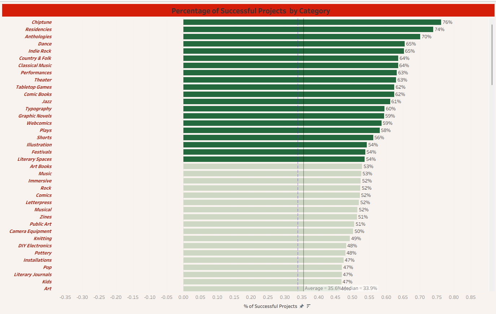

# 🚀 Kickstarter Crowdfunding: End-to-End Data Analysis
**Tools Used:** Excel (Power Query), MySQL, Power BI, Tableau

## 📌 Project Overview
This project involves a deep-dive analysis of **365,890 crowdfunding projects** (2009–2019) to identify the drivers behind successful campaigns. By leveraging multiple tools, I transformed raw, messy CSV data into a suite of interactive business intelligence dashboards.

---

## 🛠 Phase 1: Data Audit & ETL (Excel)
Before moving to SQL, I used Excel as a robust ETL tool to profile the dataset.
* **Power Query:** Handled data transformation, removed null values, and standardized date formats.
* **Calendar Table:** Engineered a dynamic Calendar Table to support time-series analysis (Year, Quarter, Month).
* **Validation:** Built a pivot-based dashboard to set the "Source of Truth" for success metrics (38.35%).

---

## 🗄️ Phase 2: Data Engineering (MySQL)
I migrated the cleaned data into a relational database to perform complex aggregations.
* **Schema Design:** Created structured tables for Categories, Locations, and Creators.
* **Feature Engineering:** Converted Unix timestamps and created `goal_range` categories for better filtering.
* **Key Queries:** Used Window Functions and CTEs to calculate category-wise success percentages and top-performing projects.

---

## 📊 Phase 3: Business Intelligence (Power BI & Tableau)
I developed two distinct versions of the dashboard to demonstrate versatility in data storytelling.

### **Power BI (Enterprise BI)**
* **Features:** Sidebar navigation panel, DAX-calculated measures, and dynamic hyperlinked project lists.
* **Focus:** High-performance reporting for executive decision-making.

### **Tableau (Advanced UX)**
* **Features:** Interactive navigation buttons and Level of Detail (LOD) expressions for geographic trends.
* **Focus:** Visual exploration of the 169 project categories.

---

## 🛡️ Data Integrity & QA
Leveraging my background in **Quality Assurance (Accenture)**, I performed a manual reconciliation between SQL outputs and Dashboard totals, ensuring 100% data consistency across all platforms.
